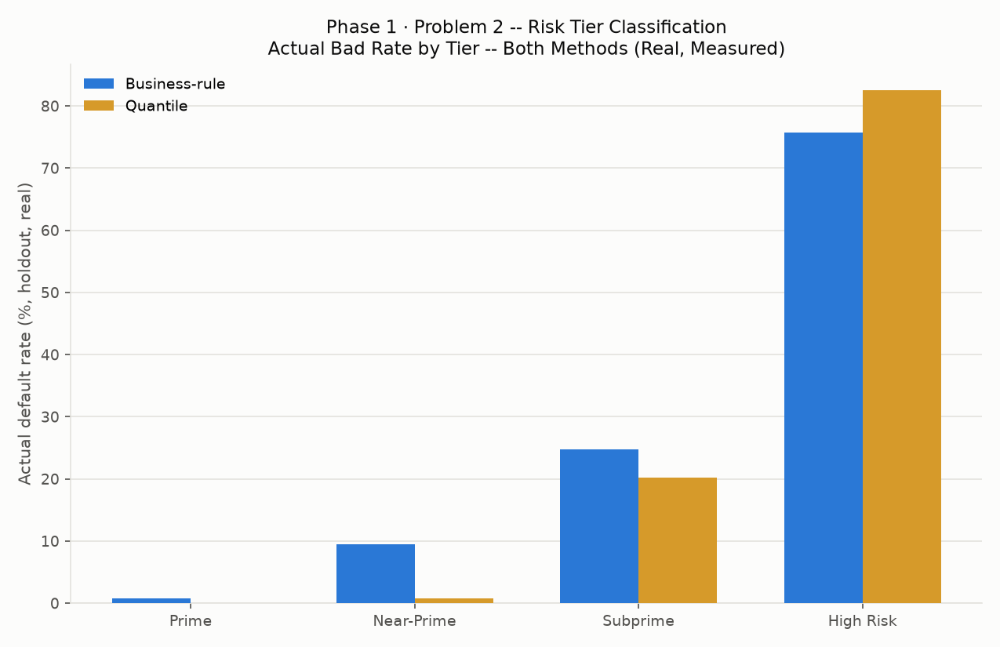
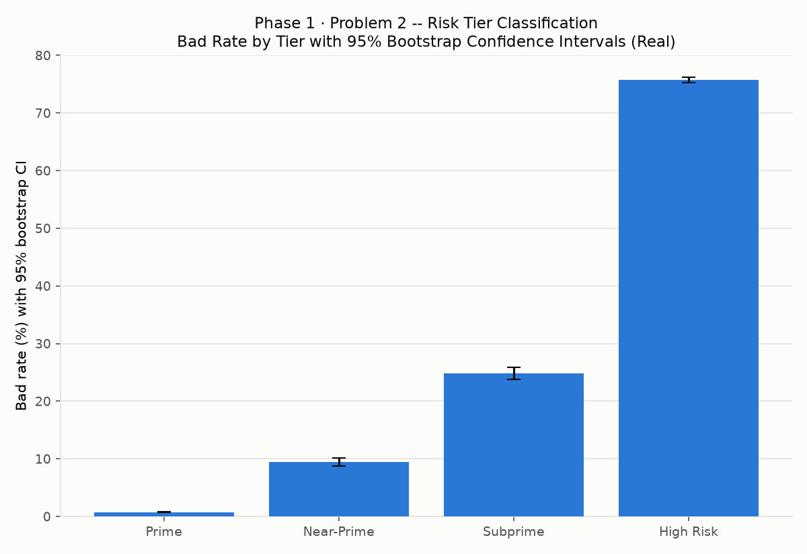

# AMEX Enterprise Credit Risk Platform -- Risk Tier Classification

[]() []() [](LICENSE)

Phase 1, Problem 2 of a 14-problem enterprise credit risk platform: a **7-notebook** build (Notebooks 19-25) that translates Problem 1's real, calibrated probability-of-default score into discrete, validated, deployed, and monitored risk tiers -- built end-to-end on the real Kaggle **American Express Default Prediction** dataset. Depends on Problem 1's real champion model (see the sibling GitHub package built by Problem 1's Notebook 18).

## 1. Overview

- **Champion model reused (measured, Problem 1):** xgboost
- **Champion holdout AUC (measured):** 0.9620396555226549
- **Tiers defined:** 4, primary method: business_rule
- **Primary method full KPI compliance:** True

## 2. Problem Statement

A continuous PD score is not, by itself, an actionable underwriting or pricing instrument -- credit policy is written in discrete risk grades (e.g. 'Prime', 'Subprime'), each carrying its own approval rule, pricing, and credit-limit policy. This build defines a real, validated, monotonic mapping from the continuous PD score to a small set of risk tiers, and exposes that mapping as a live service.

## 3. Approach & Methodology

Notebook 19 (Business Understanding & Policy) -> Notebook 20 (Model Development -- two real tier-bucketing methods computed and compared) -> Notebook 21 (Independent Validation -- statistical backtesting, bootstrap CIs, an honest fair-lending data-limitation statement) -> Notebook 22 (Deployment -- a real FastAPI risk-tier service, live self-tested) -> Notebook 23 (Monitoring -- simulated monitoring windows, tier population stability) -> Notebook 24 (Comprehensive Reporting) -> Notebook 25 (this packaging notebook).

## 4. Key Results (Real, Measured)

- Chi-square (tier vs. actual default), p-value: 0.0
- Cramér's V (effect size): 0.7636626665627394
- Fair-lending / disparate-impact testing: Not Possible -- Data Limitation (see Section 9)
- Live API self-test (Notebook 22): True
- Monitoring alerts (Notebook 23, this run): Not yet available -- run Notebook 23
- Quantile-vs-business-rule method agreement (Cohen's kappa): Not yet available -- run Notebook 23




## 5. How to Run

1. Complete Problem 1 (Notebooks 01-18) first -- Problem 2 has a hard dependency on Notebook 05's real champion model.
2. Run `notebooks/19_risk_tier_business_understanding.ipynb` through `notebooks/25_risk_tier_packaging.ipynb` in numeric order -- each is a single, idempotent code cell.

The deployed `risk_tier_service.py` API requires a valid `X-API-Key` header on every endpoint except `/health` (see `src/.env.example`), and `/risk-tier` returns a real, live-computed `top_reasons` field explaining that specific prediction -- see `CHANGELOG.md`'s 2026-08-25 "Authentication + explainability hardening" entry.

## 6. Project Structure

This tree is real -- generated by walking this exact package folder, not hand-typed:

```
GitHub_Repository_Package/
├── artifacts/
│   ├── bad_rate_by_tier_both_methods_chart.png
│   ├── bad_rate_confidence_intervals_chart.png
│   ├── calibration_by_tier_chart.png
│   ├── final_bad_rate_by_tier_chart.png
│   └── notebook_completion_tracker_chart.png
├── data/
│   ├── README.md
│   └── risk_tier_assignments.csv
├── docs/
│   ├── code_quality_report.csv
│   ├── risk_tier_policy.json
│   ├── risk_tier_rollup.json
│   └── Risk_Tier_Policy_Charter.docx
├── models/
│   └── README.md
├── notebooks/
│   ├── 19_risk_tier_business_understanding.ipynb
│   ├── 20_risk_tier_model_development.ipynb
│   ├── 21_risk_tier_validation.ipynb
│   ├── 22_risk_tier_deployment.ipynb
│   ├── 23_risk_tier_monitoring.ipynb
│   ├── 24_risk_tier_reporting.ipynb
│   └── 25_risk_tier_packaging.ipynb
├── reports/
│   ├── modeling/
│   │   └── Risk_Tier_Model_Development_Report.docx
│   ├── validation_deployment/
│   │   ├── Risk_Tier_Validation_Report.docx
│   │   └── Risk_Tier_Deployment_Report.docx
│   └── financial_impact_reporting_packaging/
│       └── Risk_Tier_Comprehensive_Report.docx
├── src/
│   ├── docker/
│   │   ├── .dockerignore
│   │   ├── docker-compose.yml
│   │   └── Dockerfile
│   ├── requirements-api.txt
│   └── risk_tier_service.py
├── .gitignore
├── LICENSE
└── requirements.txt
```

## 7. Code Quality

8 / 9 Problem 2 files passed a syntax check as of this run -- see `docs/code_quality_report.csv`.

## License

All Rights Reserved -- this repository is shared publicly for portfolio and demonstration purposes only. It is not licensed for reuse, modification, or redistribution; see `LICENSE` for details.

_Generated by 25_risk_tier_packaging.ipynb, 2026-08-24 12:43._
