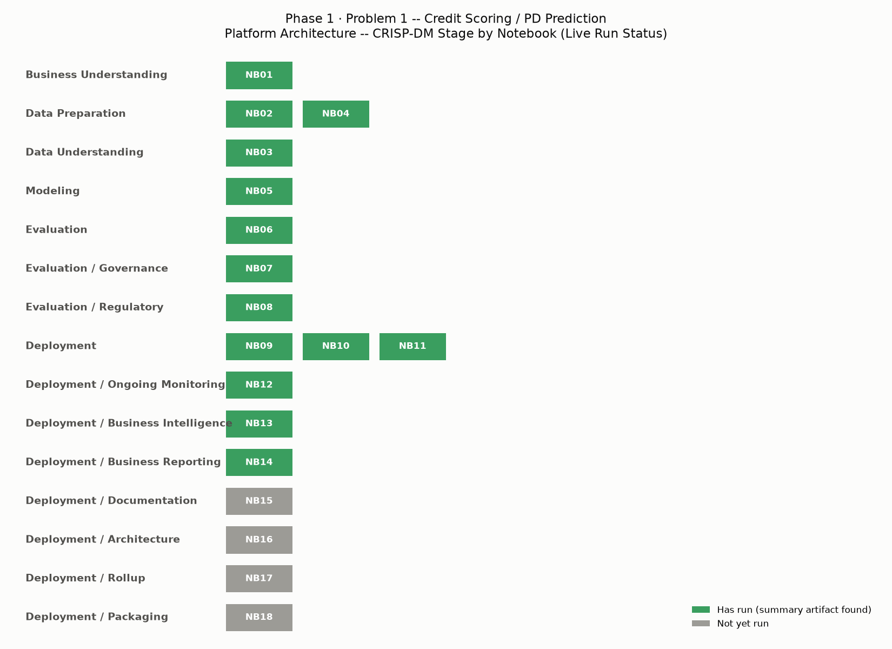
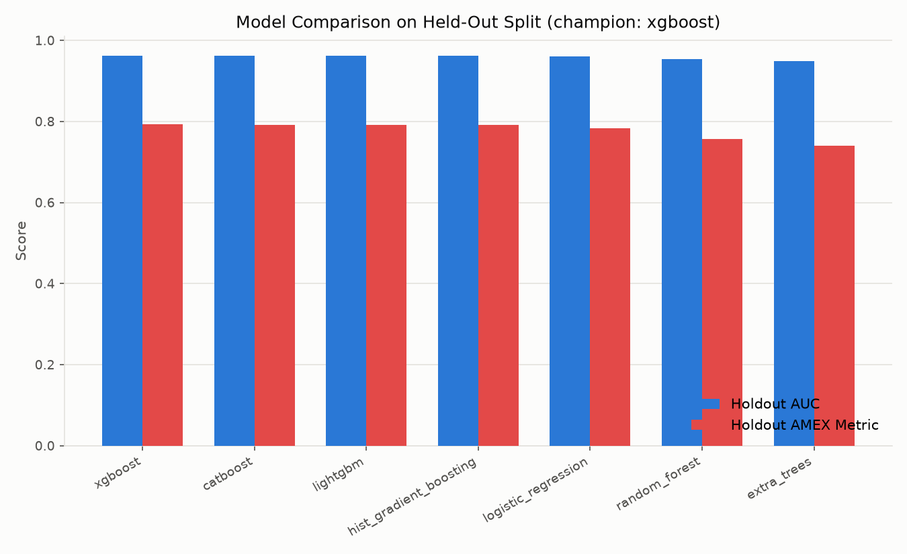
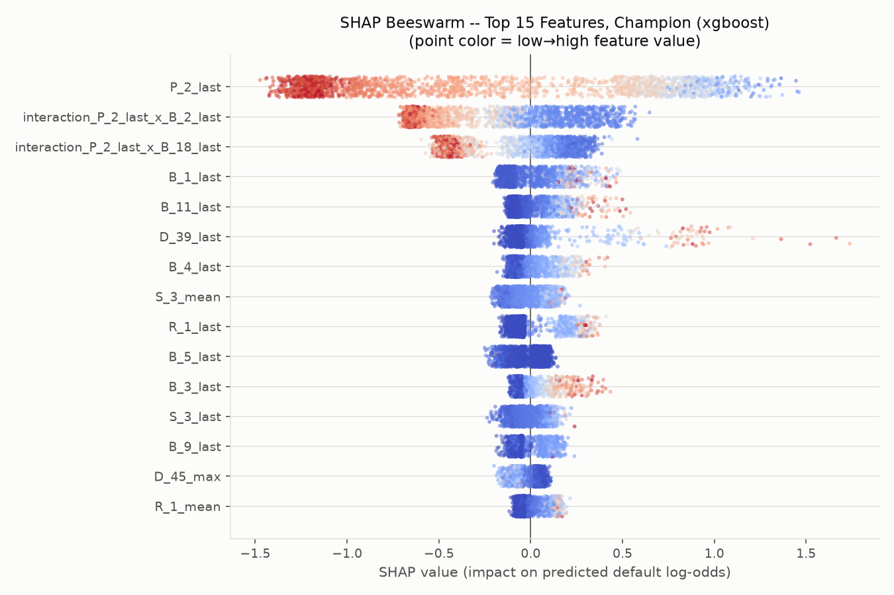
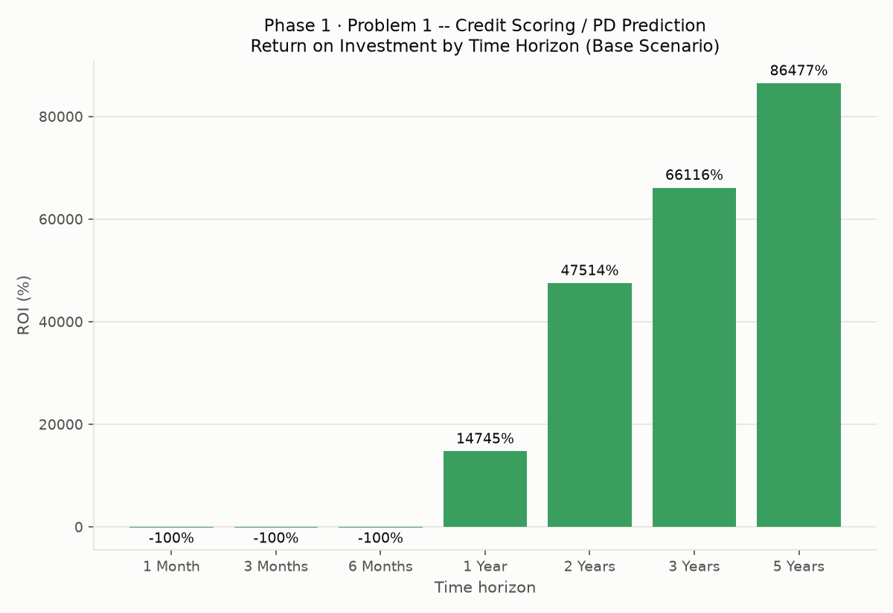

# AMEX Enterprise Credit Risk Platform

[]() []() [](LICENSE)

An **18-notebook, enterprise-grade credit risk platform** built end-to-end on the real Kaggle **American Express Default Prediction** dataset -- data engineering, modeling, explainability, model risk management, Basel III / IFRS 9 regulatory mapping, MLOps, a live FastAPI scoring service, Docker containerization, production monitoring, a Power BI-ready data model, executive financial reporting, technical documentation, production architecture, and a comprehensive rollup report.

## 1. Overview

- **Champion model (measured):** xgboost
- **Champion holdout AMEX metric (measured):** 0.7935631597243085
- **Champion holdout AUC (measured):** 0.9620396555226549
- **Core pipeline completion (Notebooks 02-16):** 100.0%

## 2. Problem Statement

Predict the probability that a credit card customer defaults, using the customer's real transaction and statement history, so a credit-risk team can price, provision, and manage portfolio risk proactively rather than reactively. Every displayed number in this repository is either computed live by that notebook's own code on the real dataset, or is an explicitly labeled, editable ASSUMPTION where the dataset genuinely has no ground truth for it (e.g. business financial assumptions) -- never silently presented as fact.

## 3. Dataset

- Training customers aggregated (measured): 458,913
- Test customers aggregated (measured): 924,621
- Live default rate, join-validated (measured): 25.89%
- Source: [Kaggle -- American Express Default Prediction](https://www.kaggle.com/competitions/amex-default-prediction)
  (raw CSVs are not redistributed here -- see `data/README.md`)

## 4. Approach & Methodology

Organized as 18 sequential notebooks around the CRISP-DM lifecycle: Business Understanding -> Data Engineering -> Data Validation/EDA -> Feature Engineering -> Model Development -> Explainable AI -> Model Risk Management -> Basel III/IFRS9 Mapping -> MLOps -> FastAPI Deployment -> Docker -> Monitoring -> Power BI Dashboard -> Executive Reports -> Technical Documentation -> Production Architecture -> Comprehensive Reporting -> Repository Packaging. See `docs/notebook_architecture_map.csv` for the full real dependency map, and `assets/architecture_diagram.png` below.



## Live Dashboards

- 📊 [Financial Impact Dashboard](https://rnanda19.github.io/AMEX_RiskIQ_Enterprise_Credit_Risk_Platform/Problem1_Credit_Scoring_PD_Prediction/reports/executive_reports/Financial_Impact_Dashboard.html) — interactive ROI, revenue-impact, and loss-reduction dashboard
- 📈 [Power BI Dashboard Preview](https://rnanda19.github.io/AMEX_RiskIQ_Enterprise_Credit_Risk_Platform/Problem1_Credit_Scoring_PD_Prediction/reports/powerbi_dashboard/PowerBI_Dashboard_Preview.html) — star-schema data model and dashboard preview

## 5. Key Results & Visuals

- Total RWA (computed, Basel III, Notebook 08): $203,644,380
- Total IFRS9 ECL (computed, Notebook 08): $67,830,906
- Inference p99 latency (measured, Notebook 09): 11.58 ms
- Batch throughput (measured, Notebook 09): 345,612 rows/sec
- Live API self-test (Notebook 10): True
- Base-scenario 5-year ROI (Notebook 14, ASSUMPTION-driven inputs): 86476.67%





## 6. How to Run

1. Install Python 3.11 (Conda or venv) and the packages in `requirements.txt`.
2. Download the real Kaggle competition CSVs (see `data/README.md`).
3. Open `notebooks/01_business_understanding.ipynb`, set `DATA_ROOT`, run its single cell.
4. Run the remaining notebooks in numeric order, 02 through 18 -- each is a single, idempotent code cell; every notebook's own intro states exactly which prior notebooks it depends on.

## 7. Project Structure

This tree is real -- generated by walking this exact package folder, not hand-typed:

```
GitHub_Repository_Package/
├── assets/
│   ├── architecture_diagram.png
│   ├── financial_roi_by_horizon_chart.png
│   ├── model_comparison_chart.png
│   ├── pillar_status_chart.png
│   ├── platform_completion_chart.png
│   ├── production_architecture_diagram.png
│   ├── shap_beeswarm_chart.png
│   └── star_schema_diagram.png
├── data/
│   └── README.md
├── docs/
│   ├── api_reference.csv
│   ├── code_quality_report.csv
│   ├── data_dictionary.csv
│   ├── glossary.csv
│   └── notebook_architecture_map.csv
├── models/
│   ├── preprocessing_artifacts.joblib
│   └── README.md
├── notebooks/
│   ├── 01_business_understanding.ipynb
│   ├── 02_data_engineering.ipynb
│   ├── 03_data_validation_eda.ipynb
│   ├── 04_feature_engineering.ipynb
│   ├── 05_model_development.ipynb
│   ├── 06_explainable_ai.ipynb
│   ├── 07_model_risk_management.ipynb
│   ├── 08_basel_ifrs9_mapping.ipynb
│   ├── 09_mlops.ipynb
│   ├── 10_fastapi_deployment.ipynb
│   ├── 11_docker.ipynb
│   ├── 12_monitoring.ipynb
│   ├── 13_powerbi_dashboard.ipynb
│   ├── 14_executive_reports.ipynb
│   └── ... (+4 more)
├── reports/
│   ├── basel_ifrs9/
│   │   └── Basel_III_IFRS9_Mapping_Report.docx
│   ├── comprehensive_reporting/
│   │   └── Comprehensive_Reporting_Report.docx
│   ├── docker/
│   │   └── Docker_Deployment_Report.docx
│   ├── executive_reports/
│   │   ├── Financial_Impact_Dashboard.html
│   │   └── Financial_Impact_Report.docx
│   ├── fastapi_deployment/
│   │   └── FastAPI_Deployment_Report.docx
│   ├── mlops/
│   │   └── MLOps_Model_Card_And_Deployment_Report.docx
│   ├── model_risk_management/
│   │   └── Model_Validation_Report.docx
│   ├── monitoring/
│   │   └── Monitoring_Report.docx
│   ├── powerbi_dashboard/
│   │   ├── PowerBI_Dashboard_Preview.html
│   │   └── PowerBI_Dashboard_Report.docx
│   ├── production_architecture/
│   │   └── Production_Architecture_Report.docx
│   └── technical_documentation/
│       └── Technical_Documentation_Report.docx
├── src/
│   ├── docker/
│   │   ├── .dockerignore
│   │   ├── docker-compose.yml
│   │   └── Dockerfile
│   ├── fastapi_service/
│   │   ├── main.py
│   │   └── requirements-api.txt
│   └── monitoring/
│       └── monitoring_job.py
├── .gitignore
├── LICENSE
└── requirements.txt
```

## 8. Technologies Used

Polars (WARP-tuned thread pools), NumPy/Pandas, scikit-learn, XGBoost/LightGBM/CatBoost, SHAP & LIME, FastAPI + Uvicorn, Docker, Power BI (star schema + DAX), python-docx/Matplotlib for reporting, psutil for adaptive resource management.

## 9. Code Quality

A live syntax and static-analysis pass runs across every notebook and standalone script this platform generates -- see `docs/code_quality_report.csv`. 20 / 20 files passed a syntax check as of this run (pyflakes not installed -- syntax-only).

## 10. Future Work

See `Production_Architecture_Report.docx` (in `reports/production_architecture/`) for every **RECOMMENDED** (not yet built) component this platform's own architecture review identified -- for example a managed feature store, an orchestration layer (Airflow/Prefect), and a real CI/CD pipeline for the FastAPI service.

## License

All Rights Reserved -- this repository is shared publicly for portfolio and demonstration purposes only. It is not licensed for reuse, modification, or redistribution; see `LICENSE` for details.

_Generated by 18_repository_packaging.ipynb, 2026-08-23 23:53._
